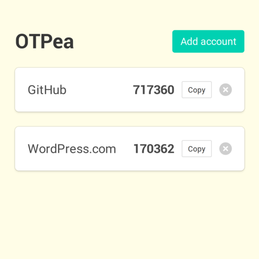

<h1 align="center">OTPea</h1>

Generate time-based OTPs. Even offline.

  

## Usage

OTPea is an application you can use to authenticate on services that support time-based OTPs.

Common examples include Google, GitHub, ProtonMail, and WordPress.com. To see if your favourite service supports this, check [Two Factor Auth List](https://twofactorauth.org/) and look for a tick in the **Software Token** column.

When you enable two-factor authentication on these sites, they will provide a software token, a "secret". Once you add this secret to OTPea, it will generate a temporary password every 30 seconds, which the service will also recognize.

## Privacy

OTPea does not send your data anywhere outside your machine. Everything lives in your browser. So if you clear your browser data, OTPea will also forget your accounts.
